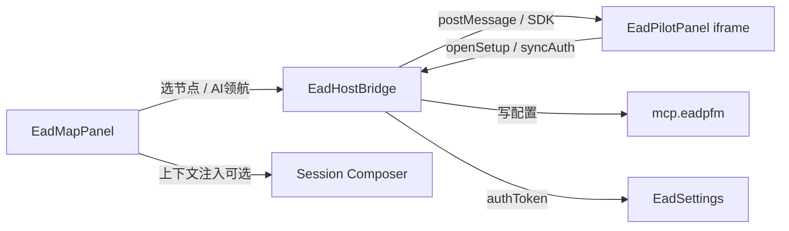

# EAD Pilot 内置集成计划（改 OpenCode，不做插件）

> 目标：把 `EAD_PFM-Editor/cursor-extension` 的能力直接做进 KloudCode 桌面 App，界面布局对齐 Cursor 里 EAD Pilot 的呈现方式。  
> 范围：改 `packages/app`（及必要的 `packages/opencode` 配置/MCP），不走第三方插件 API。  
> 状态：**实现中**（已定稿决策，开始改 App 代码）。

---

## 0. 定稿决策（2026-08-07）

| 项 | 决定 |
|----|------|
| Map | **本地 UI**（Solid，对齐 Cursor 侧栏；逻辑参考 cursor-extension） |
| Pilot / Setup | **iframe → `https://eadfm.com/plugin/ai-code`**（与 Cursor 生产包一致） |
| 环境 | **只用生产** `eadfm.com` / `https://eadfm.com/api`；不做 localhost 开发 URL |
| `mode` | **暂用 `mode=cursor` 打生产 eadfm.com**（免部署）；日后可再切 `opencode` |
| MCP | 打进桌面包 + 自动写 `opencode.json`（后续 Phase） |
| 复用 | 协议 / MCP / API / navigator 逻辑大量移植；壳与布局在 OpenCode 新写 |

---

## 1. 背景与决策

| 项 | 结论 |
|----|------|
| 交付形态 | 定制桌面 App（KloudCode），用户安装 App 即自带 EAD |
| 不做 | npm/VSIX 插件、等上游 Desktop UI Plugin API |
| 参考实现 | `/Users/michaelxie/Projects/TX/EAD_PFM-Editor/cursor-extension/` |
| 现有基础 | `ead-panel.tsx`（右栏 iframe）、`pluginPanel` layout、`plugin-registry`（未接） |

Cursor 插件的核心 UX：

1. **左侧 Activity Bar → EAD Map 侧栏**（登录、选产品、PFM/源码树、AI 领航入口）
2. **编辑器区弹出 Pilot Run Panel**（加载 `…/plugin/ai-code` 的 Web 前端）
3. **自动配置 MCP**（bundled `eadpfm`）
4. Host ↔ Webview **`postMessage` bridge**（auth、节点选择、打开 Pilot/Setup 等）

---

## 2. Cursor 中的界面呈现（参考）

### 2.1 Cursor 整体布局（草图）

```
┌────┬──────────────────┬──────────────────────────────────────────────┐
│    │                  │                                              │
│ A  │  EAD Map 侧栏     │           编辑器 / Cursor Chat                │
│ c  │  (WebviewView)   │                                              │
│ t  │                  │                                              │
│ i  │  ┌────────────┐  │                                              │
│ v  │  │ 产品切换 ▼ │  │                                              │
│ i  │  │ 登录 / 头像 │  │                                              │
│ t  │  ├────────────┤  │                                              │
│ y  │  │ PFM 树     │  │                                              │
│    │  │  · 模块    │  │                                              │
│ B  │  │  · 节点    │  │                                              │
│ a  │  │  · …       │  │                                              │
│ r  │  ├────────────┤  │                                              │
│    │  │ [AI 领航]  │──┼──► 打开右侧/中央 Pilot Panel                  │
│ E  │  └────────────┘  │                                              │
│ A  │                  │                                              │
│ D  │                  │                                              │
└────┴──────────────────┴──────────────────────────────────────────────┘
```

Activity Bar 点开 EAD 图标后，左侧出现 **EAD Map**；点「AI 领航」后弹出 **Pilot Run** Webview Panel：

```
┌────┬────────────┬─────────────────────────┬──────────────────────────┐
│Act │ EAD Map    │   编辑器（可缩小）        │  Pilot Run Panel         │
│Bar │            │                         │  (WebviewPanel)          │
│    │ 产品/树    │                         │                          │
│    │            │                         │  ┌────────────────────┐  │
│    │            │                         │  │ PluginAiCodePage   │  │
│    │ [AI领航]───┼─────────────────────────┼─►│ AiPilotDashboard   │  │
│    │            │                         │  │  · Find / Optimize │  │
│    │            │                         │  │  · Interactive Setup│ │
│    │            │                         │  └────────────────────┘  │
└────┴────────────┴─────────────────────────┴──────────────────────────┘
```

### 2.2 EAD Map 侧栏内部结构（Cursor）

```
┌─────────────────────────────┐
│ EAD Map              [↻]    │  ← view title + refresh
├─────────────────────────────┤
│ 产品: [ MyProduct      ▼ ] ⚙│  ← product switcher + edit
│ 视图: [ PFM 树 / AI Code ▼ ]│
│ 语言: [ 中文 / EN      ▼ ]  │
├─────────────────────────────┤
│ ▼ 根节点                    │
│   ▼ 模块 A                  │
│     · 用例节点              │  ← 树节点点击 → 同步上下文
│     · …                     │
│   ▶ 模块 B                  │
├─────────────────────────────┤
│ [ 🚀 AI 领航 / AI Pilot ]   │  ← 打开 Pilot Dashboard
└─────────────────────────────┘
未登录时顶部为 Sign in；登录后写 authToken + 配 MCP。
```

### 2.3 Pilot / Setup 内容（不在侧栏重做）

与 Cursor 一致：**Setup / Find / Optimize UI 复用 EAD Web 前端**，通过 URL + bridge 打开，不在宿主里重写 mindmap。

```
Pilot Panel (iframe → {serverUrl}/plugin/ai-code?...&mode=opencode)
  └─ AiPilotDashboard
        ├─ Find / Optimize EAD → GeneratePfmTreeWizard
        └─ Interactive Optimize → SetupEadMap → EADSelect
```

---

## 3. 目标：KloudCode 桌面布局（对齐 Cursor）

### 3.1 目标整体布局（草图）

保留 OpenCode 已有：最左项目/会话栏、中间 Chat、右中 Review/文件树、底栏终端。  
在此基础上对齐 Cursor：**EAD Map 靠左（Chat 左侧）**，**Pilot 靠右（可关）**。

```
┌──────┬────────────┬──────────────────┬───────────┬──────────────┐
│ Proj │  EAD Map   │   Session Chat   │ Review /  │  Pilot Run   │
│ 会话 │  (左栏)    │   (中心)         │ 文件树    │  (右栏)      │
│ 导航 │            │                  │ (可关)    │              │
│      │ 产品/登录  │  MessageTimeline │           │  iframe      │
│ rail │ PFM/源码树 │  Composer        │           │  /plugin/    │
│      │ [AI 领航]──┼──────────────────┼───────────┼─► ai-code    │
│      │            │                  │           │              │
├──────┴────────────┴──────────────────┴───────────┴──────────────┤
│ Terminal（可关，全宽）                                           │
└─────────────────────────────────────────────────────────────────┘
```

窄屏（&lt;768px）：Map / Pilot 改为抽屉或顶栏入口，不挤占 Chat。

### 3.2 与 Cursor 的对应关系

| Cursor | KloudCode 目标 |
|--------|----------------|
| Activity Bar 图标 EAD | 项目侧栏 rail 增加 EAD 入口，或 Session 标题栏「Map」开关 |
| WebviewView「EAD Map」 | Session 内 **左侧** `EadMapPanel`（常驻可开关） |
| WebviewPanel「Pilot Run」 | Session 内 **右侧** `EadPilotPanel`（替代/升级现有硬编码 `ead-panel`） |
| Setup 独立 Panel | Pilot iframe 内打开（与 Cursor 一致，不单独第三栏） |
| 编辑器标题栏「Show EAD Map」 | Session header 按钮：Toggle Map / Toggle Pilot |
| `.cursor/mcp.json` | `opencode.json` 的 `mcp.eadpfm` + 首次启动自动写入 |
| Settings `eadPfm.*` | App Settings → EAD 分区（serverUrl / apiUrl / token / productId） |

### 3.3 Header 控件草图

```
Session Header
[ … session title … ]  [🔍] [Files] [Review] [🗺 Map] [✈ Pilot] [Terminal]
                                         │              │
                                         │              └─ pluginPanel "ead:pilot"
                                         └─ layout.eadMap opened
```

### 3.4 EAD Map 面板草图（OpenCode 风格）

```
┌─ EAD Map ───────────────── [↻] [×] ─┐
│ 状态: ● 已登录  user@…               │
│ 产品: [ Acme App           ▼ ] [✎]  │
│ 视图: (•) PFM  ( ) AI Code 树       │
├─────────────────────────────────────┤
│ 🔍 过滤节点…                        │
│ ▼ Product                           │
│   ▼ Feature Pack                    │
│     · Login Flow          ← 选中    │
│     · Checkout                      │
├─────────────────────────────────────┤
│ [ AI 领航 ]                         │
│ 次要: 复制上下文 · 分析建 EAD       │
└─────────────────────────────────────┘
```

### 3.5 Pilot 面板草图

```
┌─ EAD Pilot ─────────────── [×] ─┐
│ iframe                          │
│ {serverUrl}/plugin/ai-code?     │
│   pfmNodeId=…&mode=opencode&    │
│   openAiPilot=1&…               │
│                                 │
│ （内部为现有 Web Pilot UI）      │
└─────────────────────────────────┘
  宽默认 420，min 320，max 800；可拖拽。
```

### 3.6 信息流（对齐 Cursor bridge）



---

## 4. 功能清单（从 Cursor 迁入）

### P0 — 必须有，才算「像 Cursor」

| ID | 功能 | Cursor 来源 | OpenCode 落点 |
|----|------|-------------|---------------|
| P0-1 | EAD Map 左栏（登录、产品、树、刷新） | `navigator-webview` + `EadPfmNodeSelectorProvider` | 新 `ead-map-panel.tsx` |
| P0-2 | Pilot 右栏 iframe | `createWebviewPanel` → `/plugin/ai-code` | 升级 `ead-panel.tsx` → `ead-pilot-panel.tsx` |
| P0-3 | Host bridge（auth、openAiPilot、节点上下文） | `postMessage` 协议 | `ead-bridge.ts`（iframe `contentWindow` + origin 校验） |
| P0-4 | Settings：serverUrl / apiUrl / authToken / productId | `package.json` configuration | Settings 页 EAD 段 + 本地 store |
| P0-5 | MCP 自动配置 `eadpfm` | `mcpSetup.ts` + bundled-mcp | 首次启动 /「Repair MCP」写 `opencode.json` |
| P0-6 | Header 开关 Map / Pilot | Activity Bar + commands | `session-header.tsx` |

### P1 — 完整对齐 Cursor 主流程

| ID | 功能 | 说明 |
|----|------|------|
| P1-1 | Map → AI 领航打开 Pilot Dashboard | `openAiPilotDashboard` |
| P1-2 | 源码/节点 → Find / Create EAD | `openAiFindWizard` / `openAutoCreateEad` |
| P1-3 | Setup EAD Map（iframe 内） | `openSetupEadMap`，不新建第三栏 |
| P1-4 | 复制 Active Context 到 Composer | 替代 Cursor clipboard；直接 `tui.prompt.append` 或 composer API |
| P1-5 | 语言切换（中/英）同步 Map + Pilot | `setUiLanguage` |
| P1-6 | 产品切换持久化 + 树刷新 | `productId` |

### P2 — 增强 / 可后置

| ID | 功能 | 说明 |
|----|------|------|
| P2-1 | AI Coding Jobs 列表/生命周期消息 | Cursor 侧较重，可二期 |
| P2-2 | 源码树菜单「Analyze & Create」 | OpenCode 无编辑器上下文菜单；可做文件树右键或命令面板 |
| P2-3 | localhost / production 双环境包 | 构建时注入默认 URL |
| P2-4 | 未登录引导 + MCP 修复命令 | 对齐 `repairMcpSetup` |
| P2-5 | 窄屏抽屉布局 | Map/Pilot 作 overlay |

---

## 5. 架构方案

### 5.1 模块划分（建议新建）

```
packages/app/src/
  ead/
    ead-settings.ts          # serverUrl/apiUrl/token/productId 读写
    ead-bridge.ts            # iframe postMessage 协议（从 extension.ts 精简移植）
    ead-mcp.ts               # 写入/修复 opencode.json mcp.eadpfm
    ead-map-panel.tsx        # 左栏 UI（可先 iframe 导航页，或移植 navigator chrome）
    ead-pilot-panel.tsx      # 右栏 iframe（替换现有 ead-panel）
    ead-commands.ts          # 命令：toggle map/pilot、repair mcp、copy context
  pages/session/
    … 接入 Map + Pilot 到 flex 布局
  components/session/
    session-header.tsx       # 增加 Map / Pilot 按钮
  context/
    layout.tsx               # 增加 eadMap opened/width（或复用 pluginPanels）
```

### 5.2 UI 实现策略（推荐分两步）

**Step A — 快：双 iframe**

- Map：iframe 到 EAD Web 已有 navigator/run 路由（若有）；否则先嵌入精简本地 Solid 壳 + API。
- Pilot：iframe `{serverUrl}/plugin/ai-code?mode=opencode&…`（与 Cursor `mode=cursor` 对称）。
- Bridge：只实现 P0 消息子集。

**Step B — 稳：Map 本地化**

- 把 `navigator-webview.js` 的 chrome（产品切换、树、AI 领航按钮）迁成 Solid 组件，调 Java API。
- Pilot / Setup 仍用 Web iframe（避免重写 mindmap）。

### 5.3 MCP

```jsonc
// 用户项目或全局 opencode.json（由 App 自动 patch）
{
  "mcp": {
    "eadpfm": {
      "type": "local",
      "command": ["node", "<bundled-or-resolved>/mcp-eadpfm/dist/index.js"],
      "enabled": true,
      "environment": {
        "EADPFM_API_URL": "…",
        "EADPFM_TOKEN": "…"
      }
    }
  }
}
```

Bundled MCP 可放入桌面 App resources，或首次从已知路径解析（对齐 Cursor `bundled-mcp/`）。

### 5.4 替换现有占位

当前 `ead-panel.tsx` 固定打开 `https://eadfm.com/setup-organization`，应改为：

- 默认关；用户点 Pilot 或 Map「AI 领航」再开；
- URL 带 `pfmNodeId` / `productId` / `openAiPilot`；
- 支持 localhost 与 production。

---

## 6. 布局改动点（代码落点）

| 文件 | 改动 |
|------|------|
| `packages/app/src/pages/session.tsx` | flex-row 在 Chat **左侧**插入 `EadMapPanel`；右侧用 `EadPilotPanel` 替换/包装现有 `EADPanel`；宽度计算扣除 map+pilot |
| `packages/app/src/context/layout.tsx` | `eadMap: { opened, width }` 或 `pluginPanels["ead:map"]` / `["ead:pilot"]` |
| `packages/app/src/components/session/session-header.tsx` | Toggle Map / Toggle Pilot（替换现在的笼统 Toggle EAD） |
| `packages/app/src/pages/session/ead-panel.tsx` | 演进为 Pilot；Map 新文件 |
| Settings UI | 新增 EAD 配置段 |
| `packages/desktop` / electron 打包 | 可选：打入 bundled MCP、默认 env |

---

## 7. 实施阶段

### Phase 0 — 对齐与拆消息（约 0.5–1 天）

- 从 `extension.ts` 抽出 postMessage 类型表（host→webview / webview→host）。
- 确认 Web 端 `mode=opencode` 是否已有；没有则先用 `mode=cursor` 兼容并记改造项。
- 定默认 URL：localhost vs production。

### Phase 1 — 壳与布局（约 2–3 天）

- 实现左 Map / 右 Pilot 面板壳（可先空或静态 iframe）。
- Header 双开关、宽度持久化、desktop ≥768 显示。
- 去掉/替换 setup-organization 占位。

### Phase 2 — Bridge + Auth + Settings（约 2–3 天）

- Settings 读写；登录态从 Map/API 回写 token。
- Bridge：`eadPfmSyncAuthToken`、`openAiPilotDashboard`、`updateSourceSelection`、语言同步。
- 未登录引导。

### Phase 3 — Map 业务（约 3–5 天）

- 产品列表、树加载/刷新、节点选中驱动 Pilot 上下文。
- AI 领航按钮 → 打开 Pilot。
- 复制上下文 → Composer。

### Phase 4 — MCP（约 1–2 天）

- Bundled MCP 路径解析；自动写 `opencode.json`；Repair 命令；Settings 状态展示。

### Phase 5 — 打磨与回归（约 2 天）

- 中英、窄屏、错误态、与文件树/Review 同时打开时的宽度下限。
- 对照 Cursor 主路径 E2E：登录 → 选产品 → 选节点 → AI 领航 → Find/Setup。

**合计粗估：约 2–3 周**（视 Map 是 iframe 还是本地 Solid 而定；全本地化偏上限）。

---

## 8. 非目标（本计划不做）

- 第三方可安装的 OpenCode UI 插件系统
- 在宿主内重写 Setup mindmap / GeneratePfmTree 全套 React
- 复刻 Cursor 编辑器标题栏、Explorer 右键（无对等 API）；用命令面板 / 文件树菜单近似
- 保持与上游 anomalyco/opencode 的插件 API 兼容（本功能是产品内置）

---

## 9. 风险与依赖

| 风险 | 缓解 |
|------|------|
| Web 路由仅支持 `mode=cursor` | 与 EAD Web 约定 `mode=opencode`，bridge 同源策略 |
| iframe 跨域无法任意 DOM | 只走 postMessage；origin allowlist |
| 多栏过挤（Map+Chat+Review+Pilot） | 默认 Map 开、Pilot 关、Review 关；记忆用户选择；设最小宽度 |
| MCP 与 token 不同步 | 登录成功统一走 `ead-mcp.ts` 写 env |
| navigator 逻辑在巨大 `extension.ts` | 只移植协议与 chrome，不整文件拷贝 |

---

## 10. 验收标准（对照 Cursor）

1. 打开桌面 App → 会话页可打开 **左侧 EAD Map**，布局观感接近 Cursor 侧栏。  
2. Map 内可登录、选产品、浏览树、刷新。  
3. 点 **AI 领航** → **右侧 Pilot** 打开 Dashboard，可进入 Find / Setup。  
4. 节点选择会反映到 Pilot URL/上下文。  
5. MCP `eadpfm` 自动可用（或一键 Repair 后可用）。  
6. Settings 可改 server/api；生产/本地默认正确。  
7. 关闭 Map/Pilot 后 Chat 区正常占满；与文件树共存不崩布局。

---

## 11. 界面草图汇总（ASCII）

### Cursor（现状参考）

```
[ EAD图标 ] | EAD Map 树 + AI领航 |  编辑器/Chat  | (可选) Pilot Panel |
```

### KloudCode（目标）

```
[项目会话] | EAD Map |  Session Chat | Review/文件 | Pilot |
           | (可关)  |  (主区)       | (可关)      | (可关)|
```

### 默认推荐开合

```
项目栏: 开（窄 rail）
EAD Map: 开（或首次引导后记住）
Chat: 开
Review/文件树: 关
Pilot: 关（由 AI 领航打开）
Terminal: 关
```

---

## 12. 定稿确认与首轮落地

1. Map：**本地 Solid UI**  
2. Pilot：`mode=opencode`，iframe → `https://eadfm.com/plugin/ai-code`  
3. 环境：**仅生产** eadfm.com  
4. MCP：片段可复制；自动写入 / 打包后续

**已落地：** `packages/app/src/ead/*`、左 `EadMapPanel`、右 `EadPilotPanel`、Header 双开关、Settings → EAD、删除旧 setup-organization 占位。

### 第二轮（验收向）

- Bridge 修正为 `authTokenSync`（对齐 Cursor shell）
- AI 领航 bump 重载 iframe；节点变更同步刷新 Pilot
- 登录后尝试 `mcp.add`；Settings 可 Apply MCP / 配置入口路径
- 已本地 `npm run build` mcp-eadpfm
- EAD Web 源码支持 `mode=opencode`（需部署 eadfm.com 后生产生效；iframe 检测作兜底）
- 命令面板：Toggle Map / Pilot / Open AI Pilot

